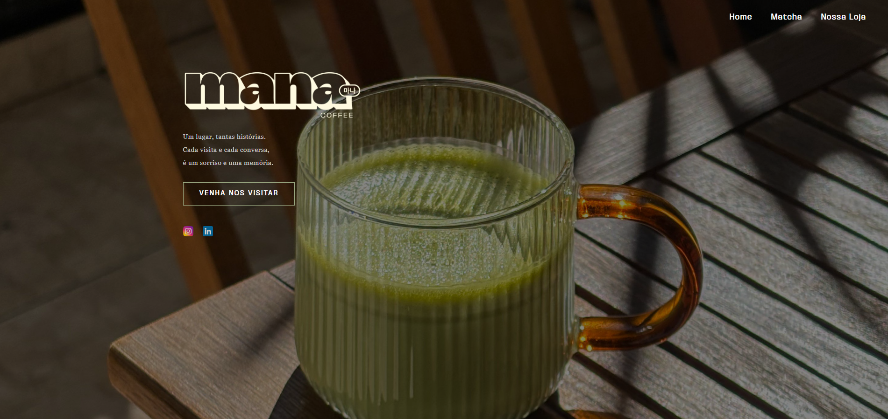
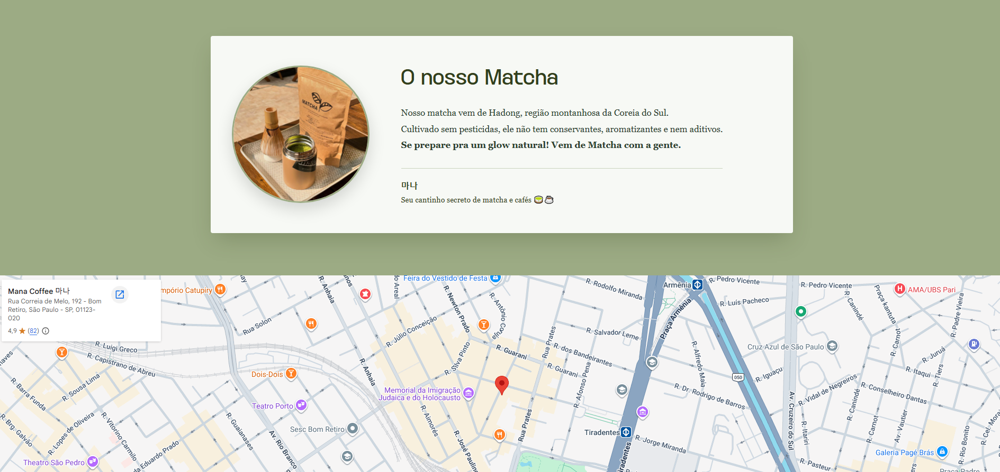
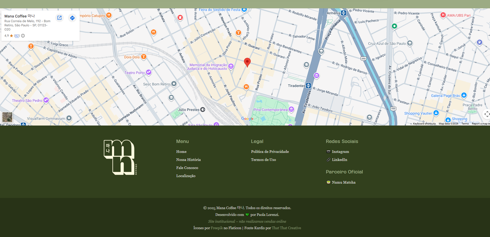

# Mana Coffee 마나 ☕🍵

Site institucional desenvolvido para o **Mana Coffee**, um café com identidade coreana localizado no Brasil, especializado em matcha e cafés especiais.

> *"Um lugar, tantas histórias. Cada visita e cada conversa, é um sorriso e uma memória."*

---

## 🌐 Deploy

**Acesse o site:** [manacoffee2.vercel.app](https://manacoffee2.vercel.app/)

---

## 📸 Preview

| Hero | Seção Matcha |
|------|-------------|
|  |  |

| Rodapé |
|--------|
|  |

---

## 📋 Sobre o Projeto

Site institucional criado para apresentar a marca **Mana Coffee 마나**, destacando:

- A história e identidade visual da marca
- Informações sobre o matcha de origem coreana (Hadong, Coreia do Sul)
- Localização da loja física
- Links para redes sociais e parceiros

> ⚠️ O site não realiza vendas online — é 100% institucional.

---

## ✨ Funcionalidades

- Página inicial com apresentação da marca
- Seção sobre o Matcha e sua origem
- Rodapé completo com menu de navegação, redes sociais e política de privacidade
- Design responsivo e estético com identidade visual própria
- Página de Política de Privacidade

---

## 🛠️ Tecnologias Utilizadas


- **HTML5** — estrutura das páginas
- **CSS3** — estilização e layout responsivo
- **Fonte customizada:** Kurdis (by That That Creative)
- **Deploy:** Vercel

---

## 📁 Estrutura do Projeto

```
manacoffee2/
├── assets/              # Imagens, ícones e logotipos
├── kurdis-font-family/  # Fonte customizada
├── index.html           # Página principal
├── privacidade.html     # Política de privacidade
└── style.css            # Estilos globais
```

---


## 👩‍💻 Desenvolvedora

Feito com 💚 por **Paola Lorenzi**

[](https://www.linkedin.com/in/paola-lorenzi-52805831b/)
[](https://github.com/lolalorenzi)
[](https://portfolio-rho-mocha-19.vercel.app/)

---

## 📄 Créditos

- Ícones por [Freepik](https://www.flaticon.com/br/autores/freepik) no Flaticon
- Fonte Kurdis por [That That Creative](https://creativemarket.com/ThatThatCreative)
- Parceiro Oficial: [Namu Matcha](https://www.instagram.com/namumatcha/)
